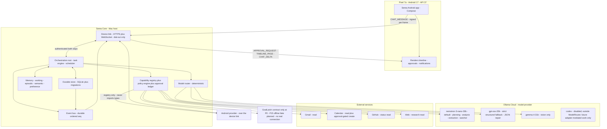

# System Overview

Architecture version: `serea-arch/0.1.0` · Status: **P0 baseline** · Frozen on 2026-10-01

Serea is a personal-assistant system. This document states what it is, draws the
system it is, names every component and its owner, and records what it
deliberately is not. The frozen contracts it implements are in
[`docs/protocols/`](../protocols/00-protocol-index.md).

---

## 1. Purpose and scope

### 1.1 What Serea is

Serea is a **single-user, host-authoritative personal assistant**. One person
speaks to one assistant; the assistant reads their world, reasons about it,
proposes actions, and — only when policy and a bounded human grant say so —
changes that world. Everything is durable, everything is auditable, and the
model has no authority whatsoever.

| Dimension | Position at `serea-arch/0.1.0` |
| --- | --- |
| Deployment | One Serea Core host process on the owner's Mac; one Pixel 7a Android client |
| Concurrency | Single user, single host. `max_concurrent_tasks` is 8 by default, not a distributed-systems exercise |
| Durability | Every task, step, receipt, grant, event and memory item is durable before the next transition ([Task Protocol §1](../protocols/02-task-protocol.md#1-model-conversation-history-is-not-task-state)) |
| Authority | Vested entirely in the host. The model proposes; the host disposes |
| Money | `cost_class: FREE` for the default model roster; cost bounds exist and are enforced regardless |
| Privacy | Personal data stays on the host unless a redaction-and-egress rule permits transit ([Data Classification §5](../protocols/09-data-classification-protocol.md#5-egress-rules)) |

### 1.2 What Serea does

Conversation; Gmail read; Calendar read; reminders; proactive suggestions;
notification analysis; web research; GitHub status; long-term memory;
scheduling; Android interaction; optional privileged Android capabilities; and —
later, behind an adapter — delegation of local PC/code work to GoalLatch.

The capability surface is **only** what is registered in the capability
registry. There is no capability outside that set, at any risk class, for any
model ([Capability Protocol §1](../protocols/01-capability-protocol.md#1-core-principle)).

### 1.3 What Serea is not

| Not this | Why it matters |
| --- | --- |
| Not an agent framework | No capability is added at runtime, by a model, by plugin discovery, or by a prompt. The registry is built at startup from provider-authored descriptors and persisted. |
| Not a chat wrapper around a model API | Conversation history is context, not state. Deleting all history must not change any task outcome ([Task Protocol §1](../protocols/02-task-protocol.md#1-model-conversation-history-is-not-task-state)). |
| Not a device-remote-control system | The Android app is a client and a human interface. Every device effect is a host-caused capability call ([Device Protocol §1](../protocols/07-device-protocol.md#1-role-of-the-device)). |
| Not GoalLatch's front end | GoalLatch is a planned capability provider behind `host.goal.*`; P0 freezes its contract only. The offline fake is planned for P15 ([GoalLatch Adapter §6](../protocols/08-goallatch-adapter-protocol.md#6-fakegoallatchprovider-specification)). |
| Not a place where a model reports success | A model's claim that it did something is not evidence. Only a provider-produced receipt is ([Capability Protocol §5.1](../protocols/01-capability-protocol.md#51-receipt)). |

---

## 2. System shape

Three properties of this diagram are architectural, not incidental.

> **The host is the only thing that holds authority.** Every arrow into a side
> effect passes through the registry and the policy engine. There is no arrow
> from `ROUTER` or from `APP` directly to `GMAIL`, `CAL`, `GH`, `WEB` or `GOAL`.

> **The model is an egress, not an ingress.** `ROUTER` sends requests and
> receives text. Nothing flows from `NANO`, `OSS` or `GEMMA` into a side-effecting
> component except as validated data.

> **GoalLatch is one provider on the same footing as any other.** It is drawn
> beside `GMAIL` and `CAL`, not above them, because that is exactly its
> architectural rank. At P0 it is contract-only; the offline fake is planned for P15.

### 2.1 The delegation arrow is a capability, not a link

The arrow describes the future authorized path through the provider boundary:
a `host.goal.*` `ActionRequest` is validated against a pinned descriptor,
policy-evaluated, approval-gated when required, invoked, receipted, and committed.
At P0, the provider is not implemented or registered; the fake is planned for
P15. It does **not** mean Serea imports GoalLatch types, links GoalLatch storage,
or reads a GoalLatch database file. See
[GoalLatch Adapter §2](../protocols/08-goallatch-adapter-protocol.md#2-forbidden-couplings).

---

## 3. Component inventory

| Component | Responsibility | Crate | Protocol it implements |
| --- | --- | --- | --- |
| Orchestration root | Composition, wiring, bootstrap order, migration gate, admin plane, process lifecycle | `serea-core` | Composition only; implements no wire contract of its own |
| Wire types and schema codegen | Frozen types, `CapabilityId`/`DataClass`/`RiskClass`/`ActionErrorKind` enums, ULID minting and parsing, canonical JSON, `Digest`, `Secret<T>`, `CredentialHandle`, JSON Schema 2020-12 codegen targets | `serea-protocol` | [Protocol Index](../protocols/00-protocol-index.md#5-serialization) §5–§6, [Data Classification §3.2](../protocols/09-data-classification-protocol.md#32-the-secrett-pattern) |
| Task engine | `AssistantTask` lifecycle, `TaskStep` records, planning, sequencing, leases, recovery, cancellation, retention | `serea-task-engine` | [Task Protocol](../protocols/02-task-protocol.md#2-assistanttask) §2–§8 |
| Model router | Model selection, `ModelCapabilities` filtering, preference chains, repair ladder, usage accounting, budget enforcement, Codex exclusion | `serea-model-router` | [Model Protocol](../protocols/03-model-protocol.md#6-model-routing) §5–§10 |
| Capability registry | Startup registration, durable persistence, version pinning, disabled overlay, duplicate detection, per-step attempt ceilings | `serea-capability` | [Capability Protocol](../protocols/01-capability-protocol.md#10-capability-registry) §8, §10 |
| Policy engine | Deterministic rule evaluation in fixed order, `RiskClass` decisions, `DenyReason`, `HandoffRequest`, audited rule changes | `serea-policy` | [Policy Protocol](../protocols/04-policy-protocol.md#42-evaluation-order) §3–§7 |
| Approval ledger | `ApprovalRequest` construction, grant minting, the six bounds, atomic consumption, expiry, denial, audit | `serea-capability` (ledger and evaluation); `serea-core` (device delivery) | [Approval Protocol](../protocols/05-approval-protocol.md#4-grant-evaluation) §2–§8 |
| Memory | Working, episodic, semantic and preference memory; extraction gating; provenance; supersession; right-to-delete cascade | `serea-memory` | [Data Classification §7–§8](../protocols/09-data-classification-protocol.md#7-classification-of-provider-data) |
| Scheduler | Event-driven wake sources, durable schedules, leases, watch cycles, proactive proposals, concurrency limits | `serea-scheduler` | [Task Protocol §6](../protocols/02-task-protocol.md#6-recovery) wake semantics; [Bounds §2](../protocols/10-bounds-protocol.md#2-the-bound-set) |
| Event bus | `SereaEvent` construction, gapless `seq` assignment at commit, append-only log, retention classes, device fan-out | `serea-event-bus` | [Event Protocol](../protocols/06-event-protocol.md#2-sereaevent) §2–§8 |
| Durable store | SQLite schema, migrations, transactional commits, leases, content-addressed blob store | `serea-storage` | [Task Protocol §5](../protocols/02-task-protocol.md#5-execution-rules) rule 1; [Event Protocol §5](../protocols/06-event-protocol.md#5-ordering-and-delivery) |
| Credential store | macOS Keychain custody, `CredentialHandle` resolution inside the process boundary, rotation | `serea-credential-store` | [Data Classification §3.1](../protocols/09-data-classification-protocol.md#31-credentialhandle), §3.2 |
| Bound enforcement | Reads and applies every bound from durable state at the moment of the check | Distributed: `serea-core` owns configuration; each owning crate enforces at its call site | [Bounds Protocol](../protocols/10-bounds-protocol.md#2-the-bound-set) §2–§7 |
| Device link | Transport, pairing, sessions, per-frame signature verification, message dedupe, notification rendering contract | `serea-core` | [Device Protocol](../protocols/07-device-protocol.md#2-transport) §2–§9 |
| Android client | Renders, collects, confirms. Renders approvals, timeline, chat, notifications. Never decides, never effects | `android/` | [Device Protocol](../protocols/07-device-protocol.md#1-role-of-the-device), §7–§8 |
| Ollama provider | `ModelProvider` implementation; HTTP, sampling, streaming, provider-specific repair quirks | `providers/serea-provider-ollama` | [Model Protocol §2](../protocols/03-model-protocol.md#2-modelprovider) |
| Gmail provider | `CapabilityProvider` for `gmail.*`; sync, message read, metadata classification, history-id handling | `providers/serea-provider-gmail` | [Capability Protocol §9](../protocols/01-capability-protocol.md#9-provider-interface) |
| Calendar provider | `CapabilityProvider` for `calendar.*`; event read, approval-gated create, receipts | `providers/serea-provider-calendar` | [Capability Protocol §9](../protocols/01-capability-protocol.md#9-provider-interface) |
| GitHub provider | `CapabilityProvider` for `github.*`; status and repository read | `providers/serea-provider-github` | [Capability Protocol §9](../protocols/01-capability-protocol.md#9-provider-interface) |
| Web provider | `CapabilityProvider` for `web.*`; fetch, extract, research summaries, egress-classified | `providers/serea-provider-web` | [Capability Protocol §9](../protocols/01-capability-protocol.md#9-provider-interface) |
| Android provider | `CapabilityProvider` for `device.*`; notification analysis, bounded media control, optional root variants over the device link | `providers/serea-provider-android` | [Device Protocol §6](../protocols/07-device-protocol.md#6-device-capability-reporting); [Capability Protocol §3.1](../protocols/01-capability-protocol.md#31-field-semantics) `root_requirement` |
| GoalLatch provider | Planned P15 `HostGoalProvider` fake behind a registry shim; no provider is implemented or registered at P0 | `providers/serea-provider-goallatch` | [GoalLatch Adapter Protocol](../protocols/08-goallatch-adapter-protocol.md#3-hostgoalprovider-interface) §3–§8 |

---

## 4. The authority model

> Serea Core owns every decision. Providers own facts. Models own nothing.
> GoalLatch is one provider.

### 4.1 Permanently owned by Serea Core

| Owned | Frozen at | Consequence if ownership moved |
| --- | --- | --- |
| Assistant task state and the task state machine | [Task Protocol §4](../protocols/02-task-protocol.md#4-task-state-machine) | Restart and conversation-truncation safety (T1–T3) become unachievable |
| Step planning, sequencing, leases, recovery | [Task Protocol §3](../protocols/02-task-protocol.md#3-taskstep), §5 | One effecting step at a time, and "persist before advancing", stop being guarantees |
| Model routing and budgets | [Model Protocol §6](../protocols/03-model-protocol.md#6-model-routing) | Determinism of routing and the Codex exclusion both become unverifiable |
| Policy evaluation | [Policy Protocol §4](../protocols/04-policy-protocol.md#42-evaluation-order) | `PolicyDecision` becomes a function of something outside the host |
| Approval and grant evaluation | [Approval Protocol §4](../protocols/05-approval-protocol.md#4-grant-evaluation) | The six bounds stop being checkable |
| Capability registry and version pinning | [Capability Protocol §10](../protocols/01-capability-protocol.md#10-capability-registry) | Descriptors stop being immutable for the life of a task |
| Memory extraction, provenance, retention, deletion | [Data Classification §7–§8](../protocols/09-data-classification-protocol.md#7-classification-of-provider-data) | "Forget this" loses the ability to cascade correctly |
| Proactive watcher | [Policy Protocol §4.3](../protocols/04-policy-protocol.md#43-additional-standing-rules) | The read-only automation invariant becomes aspirational |
| Device sessions, pairing, notification surfaces | [Device Protocol §3](../protocols/07-device-protocol.md#3-pairing), §7 | Revocation becomes a client decision |
| Event ordering and the audit trail | [Event Protocol §5](../protocols/06-event-protocol.md#5-ordering-and-delivery) | The three audit questions become unanswerable |

### 4.2 Owned by GoalLatch

Exactly one thing: execution of local PC and code development work, behind
`HostGoalProvider`, on the five `host.goal.*` capabilities, with five data types
(`GoalHandle`, `GoalObservedState`, `GoalEvidenceRef`, `GoalArtifactRef`,
`GoalSummary`) and nothing else
([GoalLatch Adapter §3.1](../protocols/08-goallatch-adapter-protocol.md#31-adapter-data-types)).

### 4.3 Owned by a provider

| Provider owns | Provider may **not** |
| --- | --- |
| Its own `CapabilityDescriptor` set and their schemas | Change its `risk_class`, `required_authorization` or `data_class` at call time |
| Translating a validated `ActionRequest` into its external API call | Read policy, approve itself, escalate, or reach another provider's credentials |
| Producing `ActionResult`, `Evidence` and `SideEffectReceipt` | Return `SUCCEEDED` with a null receipt when `side_effect_class != NONE` |
| Declaring `ProviderHealth` and degrading itself to `Degraded` | Return loosely-shaped output and rely on a lenient downstream check |

### 4.4 Owned by the model

One thing: a **proposal**. A `ModelResponse.structured` payload is
recommendation-shaped input that must still pass schema validation, registry
lookup, policy, approval, provider invocation and receipt capture
([Model Protocol §4.1](../protocols/03-model-protocol.md#41-the-trust-boundary-stated-precisely)).
The full list of what it cannot do is in
[Trust Boundaries §3.2](02-trust-boundaries.md#32-what-a-model-cannot-do).

---

## 5. Model roster in this architecture

| Model ID | Role | Reached by |
| --- | --- | --- |
| `nemotron-3-nano-30b` | Default assistant; planning; email/calendar analysis; memory extraction; proactive watcher | First position of every normal purpose chain |
| `gpt-oss-20b` | Strict structured-output fallback; JSON/tool-plan repair; alternate reasoning | Second position, and the configured structured-repair model |
| `gemma-4-31b` | Vision and screenshot interpretation | Only when an input is an image and `vision: true` is required |
| `codex` | Registered as **known and disabled** | Unreachable in every normal path; any future delegated path remains separate from ModelRouter fallback and requires an explicitly authorized adapter phase |

Routing is deterministic given `(purpose, required_capabilities, data_class,
task_constraints, health)`. No component asks the model which model to use, and
no component branches on provider identity
([Model Protocol §6.1](../protocols/03-model-protocol.md#61-routing-is-not-escalation)).

---

## 6. Non-goals at this phase

| Non-goal | Detail |
| --- | --- |
| **No GoalLatch provider at P0** | The `host.goal.*` contract is frozen but unavailable at P0; the offline fake is planned for P15. There is no network, filesystem, subprocess, or `local_mcp::*` edge. A real adapter is unscheduled and requires the six live verifications of [GoalLatch Adapter §9](../protocols/08-goallatch-adapter-protocol.md#9-real-adapter-readiness-gate) plus separate explicit phase authorization. |
| **No Codex in normal paths** | `codex_allowed` defaults to `false` at task level, is not settable by model output, is not settable from the Android client, and appears in no routing chain for any purpose. See [Model Protocol §8](../protocols/03-model-protocol.md#8-codex-exclusion). |
| **No root-first design** | Root is an optional backend for a small, enumerated `device.*` set, registered as a separate `implementation_id` under the same `CapabilityId`. Root absence yields `CAPABILITY_UNAVAILABLE`, never a crash, never degraded startup, and never a fallback to a laxer path. |
| **No vector database** | Memory is SQLite plus a content-addressed blob store, with explicit provenance per item. Semantic recall is a ranking problem over durable rows, not an embedding-index problem, until an ADR says otherwise. |
| **No multi-user or multi-host** | One user, one host. Concurrency bounds exist to bound cost and blast radius, not to scale a cluster. |
| **No cloud deployment of Core** | Core is a Mac process holding a Keychain. The device dials out to it; Core never dials a device ([Device Protocol §2.1](../protocols/07-device-protocol.md#21-dial-out-is-mandatory)). |
| **No runtime capability registration** | No plugin discovery, no model-driven enablement, no per-request descriptor mutation. |
| **No silent degradation** | Cost-bound exhaustion fails the task; a provider that cannot honour its descriptor goes `Degraded` and its capabilities resolve `UNAVAILABLE`; ambiguous effects block rather than retry ([Bounds §7.3](../protocols/10-bounds-protocol.md#73-exhaustion-fails-it-never-silently-degrades), [Capability Protocol §6.2](../protocols/01-capability-protocol.md#62-the-ambiguous-rule)). |

---

## 7. Cross-references

- Structural boundaries and the authority flow: [Trust Boundaries](02-trust-boundaries.md)
- How these components become crates: [Crate Map](03-crate-map.md)
- A request traced end to end: [Execution Pipeline](04-execution-pipeline.md)
- Assets, adversaries and mitigations: `docs/threat-model/` (threat-model `TB-n`
  alignment is recorded in [Trust Boundaries §1](02-trust-boundaries.md#1-boundary-index))
- Where architecture decisions are recorded: `docs/decisions/`
