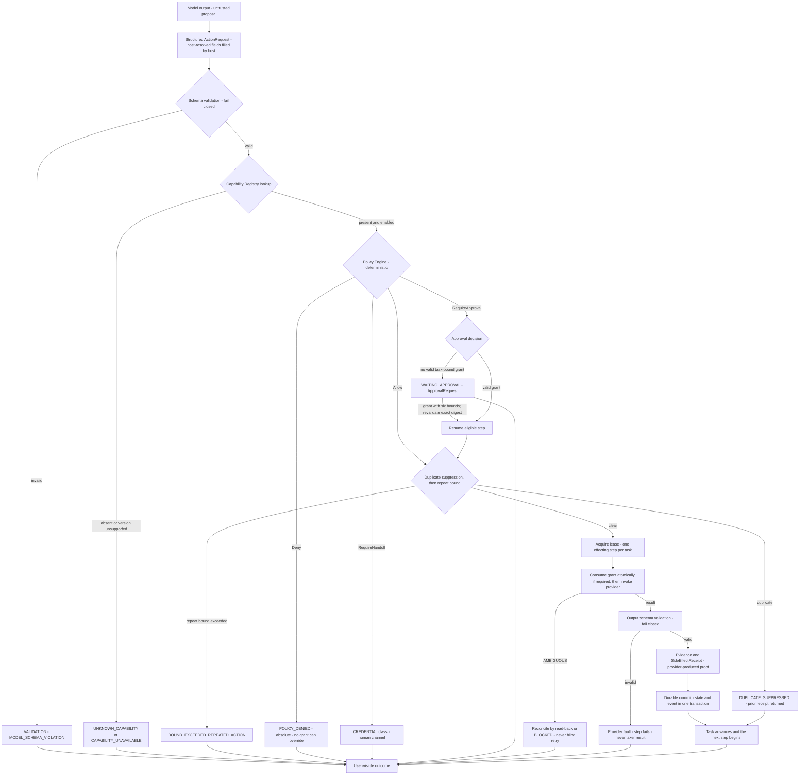

# Trust Boundaries

Architecture version: `serea-arch/2.4.0` · Status: **FROZEN current contract set** · Ratified on 2026-10-07

This document is the **architecture** view of trust boundaries: where the
structural seams are, what crosses each one, and which mechanism authenticates
and authorizes the crossing. The **threat-model** view — assets, adversaries,
attack paths, mitigations — lives in `docs/threat-model/` and uses these same
stable `TB-n` identifiers. The architecture registry owns the numbering; the
threat-model references must match each boundary's meaning exactly.

---

## 1. Boundary index

`TB-1` through `TB-8` are the established architecture registry and retain
their meanings. Additional boundaries are assigned new IDs only; IDs are never
reused. The threat model uses this same registry, with matching IDs and meanings.
A boundary added later receives the next unused ID; renumbering a registered
boundary requires an architecture-major change.

| ID | Boundary | Inside (trusted more) | Outside (trusted less) | Governing protocol |
| --- | --- | --- | --- | --- |
| `TB-1` | [Device → Core](#tb-1-device-to-core) | Serea Core host | Pixel 7a Android app, and the network in between | [Device Protocol](../protocols/07-device-protocol.md) |
| `TB-2` | [Model → Core response ingestion](#tb-2-model-to-core) | Serea Core host | Cloud model providers (Ollama Cloud) and untrusted model output | [Model Protocol](../protocols/03-model-protocol.md) |
| `TB-3` | [Core → External service](#tb-3-core-to-external-service) | Serea Core host | Gmail, Calendar, GitHub, Web | [Capability Protocol](../protocols/01-capability-protocol.md), [Data Classification](../protocols/09-data-classification-protocol.md) |
| `TB-4` | [Host → Credential store](#tb-4-host-to-credential-store) | macOS Keychain | Serea Core host code, providers | [Data Classification §3](../protocols/09-data-classification-protocol.md#3-credential-exclusion) |
| `TB-5` | [Host → GoalLatch adapter](#tb-5-host-to-goallatch-adapter) | Serea Core host | GoalLatch / Local MCP, reachable only through the adapter | [GoalLatch Adapter Protocol](../protocols/08-goallatch-adapter-protocol.md) |
| `TB-6` | [Host → Local OS resources](#tb-6-host-to-local-os-resources) | Serea Core host | Filesystem, subprocesses, network endpoints, and any future root path | [Capability Protocol §3.1](../protocols/01-capability-protocol.md#31-field-semantics), [Policy Protocol §4.3](../protocols/04-policy-protocol.md#43-additional-standing-rules) |
| `TB-7` | [Core → Durable store](#tb-7-core-to-durable-store) | Serea Core host | SQLite database file, blob store, Keychain item lifetimes | [Task Protocol §5](../protocols/02-task-protocol.md#5-execution-rules), [Event Protocol §5](../protocols/06-event-protocol.md#5-ordering-and-delivery) |
| `TB-8` | [Provider → Provider](#tb-8-provider-to-provider) | Any single provider process | Every other provider's credentials, policy state and in-flight work | [Capability Protocol §9](../protocols/01-capability-protocol.md#9-provider-interface) |
| `TB-9` | [Android app → Android OS](#tb-9-android-app-to-android-os) | Android OS services and app sandbox | Serea Android app components and notification surface | [Device Protocol §7](../protocols/07-device-protocol.md#7-notifications) |
| `TB-10` | [Host → Policy engine](#tb-10-host-to-policy-engine) | Host-controlled policy inputs and durable rules | Capability/task caller; policy decisions are deterministic and grant no authority on their own | [Policy Protocol §4.2](../protocols/04-policy-protocol.md#42-evaluation-order) |
| `TB-11` | [Retrieved content → Host ingestion](#tb-11-retrieved-content-to-host-ingestion) | Host ingestion and classification code | External content authors and providers | [Data Classification §7](../protocols/09-data-classification-protocol.md#7-classification-of-provider-data) |
| `TB-12` | [Host → Cloud model prompt egress](#tb-12-host-to-cloud-model-prompt-egress) | Host model router and egress controls | Cloud model provider; prompt content is not trusted merely because transport is authenticated | [Model Protocol §4.1](../protocols/03-model-protocol.md#41-the-trust-boundary-stated-precisely), [Data Classification §5](../protocols/09-data-classification-protocol.md#5-egress-rules) |
| `TB-13` | [Host → Device notifications](#tb-13-host-to-device-notifications) | Host redaction and notification rendering | Device notification manager and other notification-listener apps | [Device Protocol §7](../protocols/07-device-protocol.md#7-notifications) |
| `TB-14` | [Scheduler/watcher → Task engine](#tb-14-schedulerwatcher-to-task-engine) | Host task engine and policy | Durable wake sources and proactive watcher candidates | [Policy Protocol §4.3](../protocols/04-policy-protocol.md#43-additional-standing-rules), [Bounds §2](../protocols/10-bounds-protocol.md#2-the-bound-set) |
| `TB-15` | [Local admin → Host controls](#tb-15-local-admin-to-host-controls) | Host policy, approval, and bound state | Local admin session and configuration surface | [Policy Protocol §7](../protocols/04-policy-protocol.md#7-policy-changes-are-audited), [Bounds §2](../protocols/10-bounds-protocol.md#2-the-bound-set) |

`TB-2` is the model-response ingress boundary: `ModelResponse` is untrusted
input from the cloud model and is validated before use. Its outbound `ModelRequest`
prompt path has its own ID, `TB-12`. `TB-6` includes the root capability surface
and local OS resources; `TB-3` covers external provider calls, while untrusted
returned content is separately named at `TB-11`.

### 1.1 Boundaries included within an existing registry entry

| Non-boundary | Why it is not one |
| --- | --- |
| The Linux/macOS kernel underneath Core | Core runs on it; it is not a crossing Serea controls or authenticates. The root path is `TB-6` and it is an *authorized* crossing, not a trusted one. |

---

## 2. Boundaries in detail

### TB-1: Device to Core

> The device proves who it is once, to a host that a human is standing at.
> After that the device's key is its name, and revocation is a host decision.

| Property | Value |
| --- | --- |
| What crosses | `CHAT_MESSAGE`, `APPROVAL_RESPONSE`, `NOTIFICATION_ACK`, `TIMELINE_PAGE_REQUEST`, `DEVICE_CAPABILITY_REPORT`, `DEVICE_EVENT`, `RECONNECT` inbound; `APPROVAL_REQUEST`, `TIMELINE_PAGE`, `CHAT_DELTA`, `TASK_STATE_CHANGED`, `SESSION_ENDED` outbound |
| Authentication | Mutual Ed25519 handshake plus a per-device long-lived credential; every subsequent frame signed with the device key over canonical-JSON envelope and verified per frame. Host key fingerprint pinned at pairing |
| Session | `ses_` + ULID, one `DeviceId`, max 24 h absolute, 15 min idle, transport-bound |
| Authorization | **A session authorizes nothing.** Authority over a world effect is lent separately, per action, as a task-bound `ApprovalGrant`. `DEVICE_CAPABILITY_REPORT` informs availability only |
| Elevated actions | `ELEVATED_DEVICE` additionally requires on-device biometric confirmation with no fallback; the host receives a boolean attestation, never biometric material |
| Idempotency | At-least-once delivery made safe by dedupe on `message_id`; device retains 2048 inbound ids, host retains 4096 per session |
| Governing protocol | [Device Protocol](../protocols/07-device-protocol.md#2-transport), [Approval Protocol §5](../protocols/05-approval-protocol.md#5-device-bound-approval) |
| Architecture owner | `serea-core` (transport, pairing, sessions) and `serea-scheduler` (presence-driven wake) |
| Invariants | D1–D12 in [Device Protocol §10](../protocols/07-device-protocol.md#10-invariants-summary) |

The three structural facts this boundary buys: the host never opens a connection
to a device, so there is no inbound device port to defend; a compromised device
can lie about *itself* but cannot manufacture authority it was never granted;
and revocation is a single host-side decision that immediately terminates
sessions.

### TB-2: Model to Core

> The model is an untrusted, replaceable, fallible component with zero authority.

| Property | Value |
| --- | --- |
| What crosses | Inbound `ModelResponse` (`content`, `structured`, `finish_reason`, `usage`) from the cloud model; outbound prompts are covered by `TB-12` |
| Authentication | Provider API credential resolved inside `TB-4`; the host identifies itself per provider configuration. There is no mutual identity with the model |
| Authorization | **None, by construction.** The model is not authorized to do anything; it is permitted to produce text. `requested_by: MODEL` records provenance and confers authority zero |
| Data class | `PUBLIC` and `PERSONAL` by default. `PRIVATE` only when `cloud_model_private_egress` is enabled. `SECRET` and `CREDENTIAL` **never**, under any configuration |
| Structural exclusion | A `CREDENTIAL` cannot be expressed as capability input at all, so no model-authored text can carry one; `Secret<T>` has no `Serialize`, so no serialisation sweep can promote one into a prompt |
| Governing protocol | [Model Protocol](../protocols/03-model-protocol.md#41-the-trust-boundary-stated-precisely), [Data Classification §5](../protocols/09-data-classification-protocol.md#5-egress-rules) |
| Architecture owner | `serea-model-router` |
| Invariants | DC1, DC2, DC6, DC7, DC9, DC13 |

The mandatory non-bypassable stage between this boundary and any effect is:

```text
ModelResponse.structured
  -> schema validation against the host-defined response_format
  -> envelope validation: host resolves capability_id, drops unknown fields,
     records MODEL_SCHEMA_VIOLATION on any host-resolved field the model emitted
  -> ActionRequest
```

### TB-3: Core to external service

> A provider is the only place a side effect occurs, and it has no ambient
> authority.

| Property | Value |
| --- | --- |
| What crosses | Validated `ActionRequest` inbound to a provider; provider credentials outbound (resolved inside `TB-4`); `ActionResult`, `Evidence`, `SideEffectReceipt`, `ActionError` inbound to the host |
| Authentication | OAuth / API credentials held in the macOS Keychain, resolved to bytes inside `TB-4` and used for exactly one call |
| Authorization | **None of it comes from the network.** The provider does not decide whether it may act; the policy engine and approval ledger already did, and the provider cannot read either |
| Structured exclusion | `input_schema` is `additionalProperties: false` with an explicit property allowlist, compiled and checked at registration. An undeclared property is a `VALIDATION` error before the policy engine and before the provider |
| Failure behaviour | A provider that cannot honour its descriptor marks itself `Degraded` and stops advertising the capability; the registry treats it `UNAVAILABLE`. It never returns loosely-shaped data |
| Governing protocol | [Capability Protocol §9](../protocols/01-capability-protocol.md#9-provider-interface), §3.1 |
| Architecture owner | Each `providers/serea-provider-*` crate; routing by `serea-capability` |
| Invariants | C1, C2, C4, C7, C8 |

Per-provider classification, from
[Data Classification §7](../protocols/09-data-classification-protocol.md#7-classification-of-provider-data):
Gmail bodies and attachments arrive `PRIVATE` and stay in the provider cache;
message metadata is `PERSONAL`; calendar titles, locations and attendees are
`PRIVATE`; calendar times and busy flags are `PERSONAL`.

### TB-4: Host to credential store

> Credentials are not data Serea handles. They are data Serea references.

| Property | Value |
| --- | --- |
| What crosses | Outbound: `(provider_id, scope_digest, key_generation)` to mint or rotate. Inbound: `Secret<Vec<u8>>` for the duration of one call, zeroized on drop |
| What must never cross | Secret bytes to any log, error message, event payload, `arguments_preview`, notification body, or model prompt |
| Authentication | macOS Keychain ACL bound to the host's code identity; Android device Keystore operations are covered by `TB-9` |
| Authorization | Only host code that already passed policy may request a handle, and a `CREDENTIAL`-class capability never receives one — it is routed to `RequireHandoff` instead |
| Handle form | `CredentialHandle` reuses the frozen `Digest` wire form, `sha256:` + 64 lowercase hex. It is not an address and leaks no service name, account, path or slot |
| Governing protocol | [Data Classification §3.1](../protocols/09-data-classification-protocol.md#31-credentialhandle), §3.2, §5 |
| Architecture owner | `serea-credential-store`; `CredentialHandle` and `Secret<T>` are declared in `serea-protocol` |
| Invariants | DC1, DC5, DC6, DC7 |

This boundary is the only place in the system where secret bytes exist outside
the operating system's own storage. Everything on the Core side of it is a
digest.

### TB-5: Host to GoalLatch adapter

> GoalLatch is a delegate, not a hub. Serea Core remains the only system that
> decides what work exists and what authority it carries.

| Property | Value |
| --- | --- |
| What crosses | Exactly five `ActionRequest`s (`host.goal.start` / `run` / `status` / `cancel` / `result`) and their `ActionResult`s, each wrapping five data types: `GoalHandle`, `GoalObservedState`, `GoalEvidenceRef`, `GoalArtifactRef`, `GoalSummary` |
| Authentication | `ProviderContext.credential_handle()` is `None` for every `goallatch` call. The adapter receives no credential and no ambient authority |
| Authorization | A `DELEGATED_HOST_GOAL` task's `policy_class` is host-assigned at creation and immutable; broader authority requires a separate user request creating a new task. An ordinary capability grant cannot raise the ceiling. `SCOPED_GRANT` is mandatory for `start`, `run` and `cancel`; no policy rule can turn an effecting goal call into an automatic allow |
| Structural exclusion | No GoalLatch internal Rust type, no `local_mcp::*` path at any depth, no direct reads of GoalLatch storage, no goal-handle parsing, no shared type between the fake and a real adapter, and no path to `HostGoalProvider` other than the registry shim |
| State at P0 | Contract only; no GoalLatch provider is implemented or registered. The offline `FakeGoalLatchProvider` is planned for P15. No network, filesystem, or subprocess connection is permitted before its separately scoped fake-only work. |
| Governing protocol | [GoalLatch Adapter Protocol](../protocols/08-goallatch-adapter-protocol.md) |
| Architecture owner | `providers/serea-provider-goallatch` |
| Invariants | G1–G13 in [§11](../protocols/08-goallatch-adapter-protocol.md#11-invariants-summary) |

### TB-6: Host to local OS resources

> Every capability is an enumerated, descriptor-pinned operation. There is no
> arbitrary-command capability at any risk class.

| Property | Value |
| --- | --- |
| What crosses | Filesystem reads of Serea's own store and blob directory; blob writes for received artifacts; outbound HTTPS to named provider endpoints; subprocesses — none in P0 |
| Authentication | Process-local. There is no credential for "read my own store"; the threat is a capability escaping its declared path, not a remote attacker |
| Authorization | Constrained by `CapabilityDescriptor` fields: `max_duration_ms` caps every call; the blob store path is content-addressed and P0 contains no capability exposing an arbitrary path |
| Root | `root_requirement` is `NOT_REQUIRED` for every capability in P0 except the enumerated `OPTIONAL_ROOT` `device.*` set. Root requires approval, always; no rule can auto-grant it. Root absence is `CAPABILITY_UNAVAILABLE`, never a crash |
| Prohibited structurally | There is no `execute_arbitrary_shell` capability, no pattern-matched filesystem capability, and no way for a model to name a path, host, or command |
| Governing protocol | [Capability Protocol §3.1](../protocols/01-capability-protocol.md#31-field-semantics), [Policy Protocol §4.3](../protocols/04-policy-protocol.md#43-additional-standing-rules), [Bounds §8](../protocols/10-bounds-protocol.md#8-bounds-are-not-security-policy) |
| Architecture owner | `serea-storage` (store paths), each provider (its own endpoints), `serea-capability` (deadlines) |
| Invariants | C2, C9 |

### TB-7: Core to durable store

> A step's success and its receipt are persisted before the task advances. An
> event and the state change it describes commit in one transaction.

| Property | Value |
| --- | --- |
| What crosses | Task rows, step rows, receipts, grants, event rows, memory items, blob references, lease ownership, bound counters — all outbound from Core; all inbound as committed state |
| Authentication | None required; the store is inside the host trust domain. Filesystem permissions are defence in depth, not the mechanism |
| Authorization | Retention policy and the sealed-store rule are enforced by `serea-storage`. `SECRET` may live only in the sealed store, never in the general database and never in the events table; `CREDENTIAL` is refused in all Serea-owned storage |
| Atomicity guarantees | Event + state change in one transaction; grant consumption atomic per `step_id`; token accounting inside the usage transaction; `seq` assigned at commit, gapless |
| Governing protocol | [Task Protocol §5](../protocols/02-task-protocol.md#5-execution-rules), [Event Protocol §5](../protocols/06-event-protocol.md#5-ordering-and-delivery), [Data Classification §5](../protocols/09-data-classification-protocol.md#5-egress-rules) |
| Architecture owner | `serea-storage`, with `serea-event-bus` owning event append |
| Invariants | T1, T4, T5, E3, E4, DC12 |

This boundary is where crash-safety is bought. Everything upstream of a commit
is re-derivable; everything downstream is durable fact.

### TB-8: Provider to provider

> A provider receives no ambient authority: it cannot read policy, approve
> itself, escalate, or reach another provider's credentials.

| Property | Value |
| --- | --- |
| What crosses | Nothing. This is a boundary defined by what is *absent* |
| Authentication | None |
| Authorization | Each provider holds a `CredentialHandle` for its own `provider_id` and scope only. Handles are derived from `(provider_id, scope_digest, key_generation)`, so provider A cannot name provider B's secret |
| Structural exclusion | Providers share no mutable state, no database handle, and no message bus. The registry passes an `ActionRequest` and a `ProviderContext`; the provider returns an `ActionResult`. There is no provider-to-provider callback |
| Correlated-rule edge case | Duplicate suppression is the one place two calls interact. It is a *host* function over durable state, evaluated before invocation, keyed on `(capability_id, arguments_digest)` — a provider never observes another's call |
| Governing protocol | [Capability Protocol §9](../protocols/01-capability-protocol.md#9-provider-interface), [Bounds §5.1](../protocols/10-bounds-protocol.md#51-interaction-with-idempotency-keys) |
| Architecture owner | `serea-capability` |

### TB-9: Android app to Android OS

Android OS services enforce the app sandbox, Keystore access, biometric prompts,
notification posting and listener access, and component/intent routing.
Notification-listener observations stay device-local unless the user explicitly
selects and submits text to Serea. Serea verifies the platform results it relies
on, but exported-component input remains untrusted and the OS does not grant the
app authority over host actions.

### TB-10: Host to policy engine

The host supplies the descriptor, task policy ceiling, context, data class,
configuration, and current grant facts to the deterministic policy engine.
This is an in-process boundary, not a network authentication boundary; policy
returns a decision and cannot mint or consume an approval grant.

### TB-11: Retrieved content to host ingestion

Provider responses and externally authored content—including mail, calendar
descriptions, and web text—are classified by origin and treated as untrusted
input. Android notification-listener observations remain device-local at this
boundary; only text explicitly selected and submitted by the user crosses into
host ingestion, and it remains untrusted content. Provider authentication does
not authenticate the truth or instructions in returned content.

### TB-12: Host to cloud model prompt egress

The host sends only the prompt projection permitted by the destination-specific
egress matrix. Redaction and class checks occur before bytes enter the outbound
request; prompt instructions are not a security control. The response side is
also covered by `TB-2` and is validated as untrusted data.

### TB-13: Host to device notifications

Host-rendered notification text is redacted before it reaches the device OS.
Notifications are a display surface only: no notification action authorizes or
causes an effect. Other apps with notification-listener access are outside
Serea's control.

### TB-14: Scheduler/watcher to task engine

Durable schedule wake-ups and watcher candidates enter the task engine as
bounded proposals. The scheduler cannot acquire execution leases or sequence
steps; watcher policy remains restricted to `OBSERVE` and `LOCAL_STATE` and
cannot raise approvals.

### TB-15: Local admin to host controls

Local admin changes to policy rules, approval configuration, and global bounds
are authenticated by the local host session and audited with before/after state.
This surface is not reachable from model output or the device's ordinary
settings.

---

## 3. The authority model

### 3.1 The required execution flow

> Every arrow is a place where the host can refuse. There is no path from model
> text to a side effect that skips one.



Two properties of this graph are worth stating as architecture rather than as a
diagram detail:

| Property | Where it lives |
| --- | --- |
| **The model appears once, at the top.** There is no edge from `A` into `F`, `G`, `H` or `I`. The model cannot reach the policy engine, the approval ledger, a lease, or a provider. |
| **Every branch terminates in a refusal or a receipt, never in silence.** Each refusal is a typed `ActionError`, a durable event, and a task-state transition. There is no drop, no "best effort", and no partial acceptance. |

### 3.2 What a model cannot do

Each row names the protocol clause that makes it impossible rather than merely
discouraged.

| # | A model cannot | Because | Protocol |
| --- | --- | --- | --- |
| 1 | Cause a side effect without schema validation, registry lookup, policy, and approval | The execution flow has no bypass edge | [Capability §1](../protocols/01-capability-protocol.md#1-core-principle), invariant C1 |
| 2 | Grant itself capabilities, or enable a disabled one | The registry is built at startup from provider descriptors and has an admin-plane-only write path | [Capability §10](../protocols/01-capability-protocol.md#10-capability-registry) |
| 3 | Register a capability at runtime | No dynamic registration from model output, plugin discovery, or user prompts | [Capability §1](../protocols/01-capability-protocol.md#1-core-principle) |
| 4 | Select, suggest, lower, annotate or argue for its own `risk_class` | `ActionRequest` has no risk field; the field is host-resolved, and a model emitting one produces `MODEL_SCHEMA_VIOLATION` | [Policy §1](../protocols/04-policy-protocol.md#1-core-principle), [Capability §4.2](../protocols/01-capability-protocol.md#42-host-resolved-fields) |
| 5 | Broaden a scope, widen a grant, extend an expiry, or raise `max_uses` | The six bounds are host-constructed; device-supplied ceilings are clamped to the request's own bounds | [Approval §3.1](../protocols/05-approval-protocol.md#31-the-six-bounds), [Device §5.2](../protocols/07-device-protocol.md#52-approval_response) |
| 6 | Change a policy rule, a risk class default, or the disabled overlay | Policy mutation is reachable only from the local admin surface and is audited | [Policy §7](../protocols/04-policy-protocol.md#7-policy-changes-are-audited) |
| 7 | Fabricate an approval or a grant | There is no `MODEL` value of `granted_by`; grants are minted only on an authenticated `APPROVAL_RESPONSE` | [Approval §3.3](../protocols/05-approval-protocol.md#33-granted_by) |
| 8 | Fabricate success, a receipt, or evidence | Model self-report of having acted is never evidence; receipts are provider-produced and recorded only from an `ActionResult` | [Model §1](../protocols/03-model-protocol.md#1-core-principle), [GoalLatch §7](../protocols/08-goallatch-adapter-protocol.md#7-result-and-evidence-contract) |
| 9 | Create a new root operation, or make root available | The `OPTIONAL_ROOT` set is enumerated in descriptors; root requires approval always and no rule can auto-grant it | [Policy §4.3](../protocols/04-policy-protocol.md#43-additional-standing-rules) |
| 10 | Invoke arbitrary host, shell, or filesystem access | No `execute_arbitrary_shell` capability exists at any risk class for any model; there is no path-naming capability | [Capability §1](../protocols/01-capability-protocol.md#1-core-principle), invariant C2 |
| 11 | Reach a credential | `Secret<T>` is not `Serialize`; capability `input_schema` is `additionalProperties: false` with an allowlist; `CREDENTIAL` output is impossible | [Data Classification §4](../protocols/09-data-classification-protocol.md#4-credential-exclusion), DC8 |
| 12 | Ask for a more capable or more privileged model | Fallback is a configured, bounded, logged routing decision never triggered by response *content* | [Model §6.1](../protocols/03-model-protocol.md#61-routing-is-not-escalation) |
| 13 | Reach `codex` under any input | It appears in no routing chain, and the only path to it is a `DELEGATED_HOST_GOAL` reaching `host.goal.*`, which has no provider at P0; the offline fake is planned for P15 | [Model §8](../protocols/03-model-protocol.md#8-codex-exclusion), [GoalLatch §5.1](../protocols/08-goallatch-adapter-protocol.md#51-codex_allowed) |
| 14 | Self-terminate the loop, extend its own budget, or choose to retry | Termination is the host's; bounds are host-set, host-read-from-durable-state, and never disclosed to the model | [Bounds §1](../protocols/10-bounds-protocol.md#1-why-the-host-owns-the-loop) |
| 15 | Send a value of a class it did not receive | A consumer that computes a higher class than the producer declared treats the payload as the higher class; absence means `CREDENTIAL` | [Protocol Index §6](../protocols/00-protocol-index.md#6-envelope), DC4, DC9 |

### 3.3 What a device cannot do

| # | A device cannot | Because |
| --- | --- | --- |
| 1 | Effect anything directly | Every device effect is a host-caused capability invocation ([Device §1](../protocols/07-device-protocol.md#1-role-of-the-device), D2) |
| 2 | Widen authority with a session | A session authenticates the device, never the user's intent ([Device §4.2](../protocols/07-device-protocol.md#42-a-session-is-not-intent)) |
| 3 | Approve a high-risk action from the notification shade | Inline actions are `None` on every channel; approval requires the full screen, plus biometric for `ELEVATED_DEVICE` ([Device §7](../protocols/07-device-protocol.md#7-notifications), D10) |
| 4 | Pre-grant, queue, or auto-resolve an approval offline | Approvals for an absent device stay pending; silence never produces a grant ([Device §9.1](../protocols/07-device-protocol.md#91-approvals-cannot-be-pre-granted-offline), D12, A6) |
| 5 | Grant itself a capability by claiming one | `DEVICE_CAPABILITY_REPORT` informs availability; absence of a capability means unavailable ([Device §6.2](../protocols/07-device-protocol.md#62-the-report-grants-nothing), D9) |
| 6 | Pair a new device | The first device pairs from the host surface; every later one requires explicit host-side confirmation ([Device §3](../protocols/07-device-protocol.md#3-pairing), D7) |

---

## 4. Cross-boundary data rules

### 4.1 Permitted crossings by destination

The authoritative matrix is
[Data Classification §5](../protocols/09-data-classification-protocol.md#5-egress-rules).
This table restates it *per boundary*, which is the form the architecture
actually needs.

| Boundary | `PUBLIC` | `PERSONAL` | `PRIVATE` | `SECRET` | `CREDENTIAL` |
| --- | --- | --- | --- | --- | --- |
| `TB-1` device link | Yes | Yes, redacted | Yes, redacted, and only for surfaces that render it | **No** | **No** |
| `TB-9` device Keystore | — | — | — | — | Device keys and credentials only, non-exportable, never leaving the device |
| `TB-2` model response ingress | Untrusted model output | Untrusted model output | Untrusted model output | Untrusted model output is never treated as authority | Credentials cannot be represented |
| `TB-12` cloud model prompt egress | Yes | Yes, redacted | Only when `cloud_model_private_egress` is enabled, redacted either way | **No** | **No** |
| `TB-3` external service | Yes | Yes | Yes — the service is the user | Yes, only to the service the user named | `CREDENTIAL` to the service it authenticates, and only inside `TB-4` custody |
| `TB-4` credential store | — | — | — | — | Yes; this is the only permitted destination for `CREDENTIAL` |
| `TB-5` GoalLatch adapter | — | — | — | — | `CredentialHandle` is `None` for every call; no class is permitted to cross that was not already in the task's class ceiling |
| `TB-6` local OS | Yes | Yes | Yes, encrypted at rest | Yes, sealed store only | **No** — no Serea-owned file holds credential bytes |
| `TB-7` durable store | Yes | Yes | Yes, encrypted at rest | Sealed store only; never the general database, never the events table | **No** |
| `TB-8` provider to provider | Nothing crosses | Nothing crosses | Nothing crosses | Nothing crosses | Nothing crosses; handles are `provider_id`-scoped |
| `TB-9` Android app to Android OS | Platform-protected only | Platform-protected only | Platform-protected only | — | Device keys and credentials only, non-exportable |
| `TB-10` host to policy engine | Host policy inputs | Host policy inputs | Host policy inputs | No policy input may carry it | No policy input may carry it |
| `TB-11` retrieved content to host ingestion | Yes | Yes, source-classified | Yes, source-classified | Not accepted as ordinary retrieved content | Not accepted |
| `TB-12` host to cloud model prompts | Yes | Yes, redacted | Only when `cloud_model_private_egress` is enabled, redacted | **No** | **No** |
| `TB-13` host to device notifications | Yes | Yes, redacted | No | **No** | **No** |
| `TB-14` scheduler/watcher to task engine | Yes | Yes, within task ceiling | Per task ceiling | **No** | **No** |
| `TB-15` local admin to host controls | Host configuration | Host configuration | Host configuration | Audited local-only changes | Never secret bytes |

### 4.2 Rules that apply at every boundary

> Redaction is removal, not derivation. It lowers a projection's transit class,
> never the stored class of the original.

| Rule | Effect at every boundary |
| --- | --- |
| Compose before you cross | The `data_class` on an envelope is the composed class of the whole payload, not of its most interesting field ([Data Classification §2.2](../protocols/09-data-classification-protocol.md#22-composition)) |
| Unclassified is `CREDENTIAL` | No boundary accepts an undeclared class. There is no "probably fine" path |
| Producer declares, consumer verifies | A consumer computing a higher class than declared treats the payload as the higher class ([Protocol Index §6](../protocols/00-protocol-index.md#6-envelope)) |
| Redact before placement, never after | Unredacted bytes never enter a prompt buffer, a notification body, a log line, or an `arguments_preview` ([Data Classification §6](../protocols/09-data-classification-protocol.md#6-redaction)) |
| Prompt instructions are not controls | Nothing here depends on a model, a device, or a provider complying with an instruction |
| Deny is the default | A destination with no rule, or a mismatch between declared and computed class, is a denial |

### 4.3 Boundaries with no permitted `PRIVATE`-or-higher transit

| Boundary | Highest class that may cross in each direction | Why the tighter rule is correct there |
| --- | --- | --- |
| `TB-1` outbound to the device, for notifications | `PERSONAL` after redaction | A notification is a convenience mirror; a `PRIVATE` body adds nothing the user cannot get from the timeline ([Device §7](../protocols/07-device-protocol.md#7-notifications)) |
| `TB-1` outbound, approval prompts | `PERSONAL` after redaction | A summary that would leak the content of a secret is not a summary ([Approval §2.1](../protocols/05-approval-protocol.md#21-the-prompt-must-be-specific-enough-to-consent-to)) |
| `TB-2` outbound, `STRUCTURED_REPAIR` calls | `PERSONAL` | Repair receives the schema, the invalid payload and the error list. Never the conversation, never tool definitions ([Model §7.2](../protocols/03-model-protocol.md#72-hard-constraints-on-repair)) |
| `TB-5`, all directions | Task `policy_class` ceiling | Delegation changes what a goal *would* use; it changes nothing about who authorizes it ([GoalLatch §5](../protocols/08-goallatch-adapter-protocol.md#5-delegation-model)) |
| `TB-6` outbound to a provider endpoint | That capability's declared `data_class` | A provider may not send more than its descriptor permits, and the descriptor is immutable for the life of a task ([Capability §3.2](../protocols/01-capability-protocol.md#32-invariants)) |
