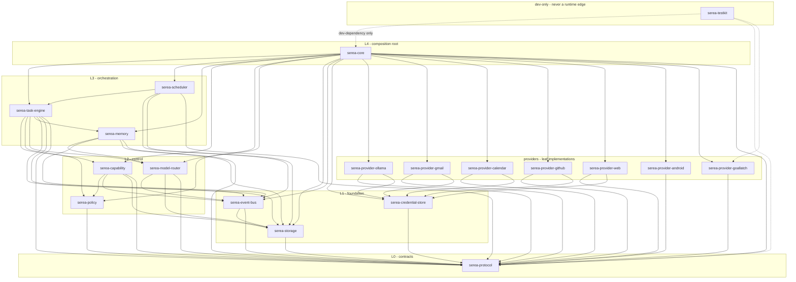

# Crate Map

Architecture version: `serea-arch/0.2.0` · Status: **P0 baseline** · Frozen on 2026-10-01

This document fixes how the Serea Core Rust workspace is divided, which crate
may depend on which, and which planned crates this architecture declines to
create at `serea-arch/0.2.0`. The tree it describes is **planned**: no
`Cargo.toml` exists yet.

---

## 1. The layering rule

> `serea-protocol` depends on nothing internal. Every other crate depends on
> `serea-protocol`. Higher layers depend on lower layers, and **no cycles**.

Three corollaries, each of which is mechanically checkable by a workspace
lint:

1. An edge `A → B` means `A` names something in `B`'s public API. A `dev-dependency`
   edge is not a layering edge and does not constrain the runtime graph.
2. A crate may not name a type from a crate two or more layers above it, even
   transitively through a re-export. Re-export chains are a cycle with extra
   steps.
3. Ports live in the lowest layer, implementations in the highest. `serea-protocol`
   declares `CapabilityProvider`, `ModelProvider` and `HostGoalProvider`; the
   concrete implementations live in `providers/`; the orchestration lives in the
   middle. This is what makes the graph acyclic *and* what makes providers
   swappable (§6).

---

## 2. Dependency layers

Reading the graph: edges point **downward** everywhere. `serea-core` is the only
crate every other crate may be reached from, and no crate reaches `serea-core`.
`serea-testkit` is drawn dashed because it is a `dev-dependency`: nothing in the
runtime graph may name it, and it may not be re-exported by any runtime crate.

### 2.1 Why `serea-provider-android` is a leaf and not a device-link owner

The Android provider needs to reach a paired device, and the device link lives in
`serea-core`. If the provider depended on `serea-core` directly, the graph would
close: `core → provider-android → core`. It does not, because the *wire types*
for `serea.device/1` and the `DeviceLinkPort` trait declaration live in
`serea-protocol`, and the link's transport implementation is injected into the
provider at composition time by `serea-core`. The provider depends on the port;
it never depends on the server.

### 2.2 Why `serea-memory` sits below the engine

Memory is written by an `EXTRACTION` step inside a task, but memory does not
schedule tasks, sequence steps, or hold leases. Putting it below the engine
means the engine can call memory without memory ever calling back into the
engine, which is what keeps the edge single-directional.

---

## 3. Crate inventory

Layer legend: **L0** contracts · **L1** foundation · **L2** control · **L3**
orchestration · **L4** composition · **PX** leaf provider · **TD** dev-only.

| Crate | Purpose | Public API surface (types only) | Depends on | Depended on by | Layer |
| --- | --- | --- | --- | --- | --- |
| `serea-protocol` | Frozen wire types, frozen enums, identifier minting, canonical JSON, schema codegen targets, trait *port* declarations | `TaskId`, `StepId`, `ApprovalId`, `EventId`, `DeviceId`, `ScheduleId`, `ProposalId`, `ReceiptId`, `SessionId`, `IdempotencyKey`, `CapabilityId`, `ProviderId`, `ImplementationId`, `ModelId`, `Digest`, `Secret<T>`, `CredentialHandle`, `Envelope<T>`, `ActionRequest`, `ActionResult`, `ActionError`, `ActionErrorKind`, `Evidence`, `SideEffectReceipt`, `CapabilityDescriptor`, `ProviderContext`, `RiskClass`, `DataClass`, `SideEffectClass`, `ReplaySafety`, `Authorization`, `ModelProvider`, `ModelRequest`, `ModelResponse`, `ModelCapabilities`, `ModelError`, `PolicyDecision`, `DenyReason`, `ApprovalRequest`, `ApprovalGrant`, `SereaEvent`, `EventKind`, `Actor`, `AssistantTask`, `TaskState`, `TaskStep`, `StepKind`, `CapabilityProvider`, `HostGoalProvider`, `GoalHandle`, `GoalObservedState`, `GoalEvidenceRef`, `GoalArtifactRef`, `GoalSummary`, `DeviceLinkPort`, `Clock`, `Ids` | *(nothing internal)* | every crate in the workspace | L0 |
| `serea-storage` | SQLite schema, ordered migrations, transactional commits, lease acquisition, content-addressed blob store, retention and redaction-at-rest | `Store`, `StoreError`, `Tx`, `LeaseGuard`, `BlobRef`, `BlobStore`, `Migrations` | `serea-protocol` | `serea-event-bus`, `serea-policy`, `serea-model-router`, `serea-capability`, `serea-memory`, `serea-task-engine`, `serea-scheduler`, `serea-core` | L1 |
| `serea-event-bus` | `SereaEvent` construction, gapless `seq` assignment at commit, append-only log, retention classes, device fan-out queue | `EventBus`, `EventPublisher`, `EventQuery`, `EventRetention` | `serea-protocol`, `serea-storage` | `serea-policy`, `serea-model-router`, `serea-capability`, `serea-memory`, `serea-task-engine`, `serea-scheduler`, `serea-core` | L1 |
| `serea-credential-store` | macOS Keychain custody; mint, resolve, rotate; the only code permitted to call `Secret::expose` | `CredentialStore`, `CredentialStoreError`, `CredentialScope`, `RotationOutcome` | `serea-protocol` | all `providers/serea-provider-*` needing OAuth or API secrets; `serea-core` | L1 |
| `serea-policy` | Deterministic rule evaluation in the frozen order; `RiskClass` decisions; `DenyReason`; `HandoffRequest`; audited rule mutation | `PolicyEngine`, `PolicyRule`, `PolicyContext`, `AutomationContext`, `RuleStore`, `PolicyChange` | `serea-protocol`, `serea-storage`, `serea-event-bus` | `serea-capability`, `serea-task-engine`, `serea-core` | L2 |
| `serea-model-router` | Model selection, capability filtering, preference chains, bounded repair ladder, usage accounting, budget enforcement, Codex exclusion | `ModelRouter`, `Roster`, `PreferenceChain`, `UsageLedger`, `BudgetView`, `RoutingDecision` | `serea-protocol`, `serea-storage`, `serea-event-bus` | `serea-memory`, `serea-task-engine`, `serea-core`, `serea-provider-ollama` (types only) | L2 |
| `serea-capability` | Runtime registry, descriptor compilation, tool router, duplicate detection, repeated-action detection, approval ledger and grant consumption, provider invocation and enforcement | `CapabilityRegistry`, `CapabilityRouter`, `ToolRouter`, `DuplicateWindow`, `ApprovalLedger`, `GrantMatcher`, `ToolCall`, `ToolOutcome` | `serea-protocol`, `serea-storage`, `serea-event-bus`, `serea-policy` | `serea-task-engine`, `serea-core` | L2 |
| `serea-memory` | Working, episodic, semantic and preference memory; extraction gating on `purpose: EXTRACTION`; provenance; supersession; deletion cascade with tombstones | `MemoryStore`, `MemoryItem`, `MemoryKind`, `Provenance`, `ExtractionOutcome`, `ForgetOutcome` | `serea-protocol`, `serea-storage`, `serea-event-bus`, `serea-model-router` | `serea-task-engine`, `serea-core` | L3 |
| `serea-task-engine` | `AssistantTask` lifecycle, plan construction and revision, step sequencing, leases, recovery, cancellation, retention, attempt budgets | `TaskEngine`, `TaskRecord`, `StepRecord`, `Plan`, `PlanRevision`, `RecoveryReport`, `CancellationOutcome` | `serea-protocol`, `serea-storage`, `serea-event-bus`, `serea-policy`, `serea-model-router`, `serea-capability`, `serea-memory` | `serea-scheduler`, `serea-core` | L3 |
| `serea-scheduler` | Event-driven wake sources, durable schedules, watcher cycles, proposal generation, task admission against `max_concurrent_tasks` | `Scheduler`, `WakeSource`, `ScheduleRecord`, `WatcherCycle`, `ProposalDraft`, `AdmissionResult` | `serea-protocol`, `serea-storage`, `serea-event-bus`, `serea-task-engine` | `serea-core` | L3 |
| `serea-core` | Composition root, bootstrap and migration gate, admin plane, device link and pairing, bound configuration, notification fan-out, provider registration and health | `SereaCore`, `CoreConfig`, `DeviceLink`, `AdminSurface`, `BoundConfig`, `ProviderRegistration`, `HealthReport` | all crates in `L0`–`L3` plus every `providers/` crate | *(nothing)* | L4 |
| `providers/serea-provider-ollama` | `ModelProvider` over Ollama Cloud; HTTP, streaming, sampling, provider-specific structured-output quirks | `OllamaProvider`, `OllamaConfig` | `serea-protocol`, `serea-credential-store` | `serea-core` | PX |
| `providers/serea-provider-gmail` | `CapabilityProvider` for `gmail.*`; incremental sync, message read, history-id handling, metadata/body classification split | `GmailProvider`, `GmailSyncCursor` | `serea-protocol`, `serea-credential-store` | `serea-core` | PX |
| `providers/serea-provider-calendar` | `CapabilityProvider` for `calendar.*`; event read, approval-gated create, receipts with `provider_reference` | `CalendarProvider`, `CalendarRef` | `serea-protocol`, `serea-credential-store` | `serea-core` | PX |
| `providers/serea-provider-github` | `CapabilityProvider` for `github.*`; repository and status read | `GitHubProvider`, `RepoRef` | `serea-protocol`, `serea-credential-store` | `serea-core` | PX |
| `providers/serea-provider-web` | `CapabilityProvider` for `web.*`; fetch, extract, research summaries under an egress-classified descriptor | `WebProvider`, `FetchPolicy` | `serea-protocol`, `serea-credential-store` | `serea-core` | PX |
| `providers/serea-provider-android` | `CapabilityProvider` for `device.*`; notification analysis, bounded media control, root and rootless `implementation_id` variants over the device link | `AndroidProvider`, `DeviceSessionView`, `RootVariant` | `serea-protocol` | `serea-core` | PX |
| `providers/serea-provider-goallatch` | Planned P15 `HostGoalProvider` fake plus registry shim for the five `host.goal.*` descriptors; not implemented or registered at P0 | `HostGoalShim`, `GoalImplementation`, `FakeGoalLatchProvider`, `GoalScenario` | `serea-protocol` | `serea-core` | PX |
| `serea-testkit` | Deterministic test doubles, fixture loaders, a manual `Clock`, and scenario builders. Never a runtime dependency of any crate | `MockModelProvider`, `MockGmailProvider`, `MockCalendarProvider`, `MockGitHubProvider`, `MockAndroidProvider`, `MockCapabilityProvider`, `TestClock`, `Fixtures`, `GoalScenarioBuilder` (P15) | `serea-protocol`, `serea-provider-goallatch` (P15 scenario harness only) | `dev-dependency` of every crate with tests | TD |

### 3.1 Ownership of each protocol contract

Exactly one crate owns each frozen contract. Two owners would mean two
implementations of a guarantee.

| Contract | Owning crate | Frozen at |
| --- | --- | --- |
| Identifier grammar, envelope, serialization, `Secret<T>` | `serea-protocol` | [Protocol Index §2](../protocols/00-protocol-index.md#2-identifier-grammar), §5, §6 |
| `CapabilityProvider` trait declaration | `serea-protocol` | [Capability Protocol §9](../protocols/01-capability-protocol.md#9-provider-interface) |
| Runtime registry, descriptor compilation, dedup, invocation and enforcement | `serea-capability` | [Capability Protocol §9](../protocols/01-capability-protocol.md#9-provider-interface), §10 |
| `AssistantTask`, `TaskStep`, state machine, recovery, cancellation | `serea-task-engine` | [Task Protocol §2](../protocols/02-task-protocol.md#2-assistanttask), §4, §6 |
| `ModelProvider` routing, repair ladder, usage ledger, Codex exclusion | `serea-model-router` | [Model Protocol §6](../protocols/03-model-protocol.md#6-model-routing), §7, §8 |
| `PolicyEngine`, `PolicyDecision`, rule store | `serea-policy` | [Policy Protocol §3](../protocols/04-policy-protocol.md#3-policydecision), §5 |
| `ApprovalRequest`, `ApprovalGrant`, six bounds including exact argument digest, consumption | `serea-capability` | [Approval Protocol §2](../protocols/05-approval-protocol.md#2-approvalrequest), §3, §4 |
| `SereaEvent`, `seq`, append-only log, retention classes | `serea-event-bus` | [Event Protocol §2](../protocols/06-event-protocol.md#2-sereaevent), §5, §8 |
| Pairing, sessions, transport, device message set, device link | `serea-core` | [Device Protocol §3](../protocols/07-device-protocol.md#3-pairing), §4, §5 |
| Bound configuration and global counters | `serea-core` | [Bounds Protocol §2](../protocols/10-bounds-protocol.md#2-the-bound-set) |
| Bound *enforcement* at the call and step sites | the crate that owns the call | [Bounds §2.1](../protocols/10-bounds-protocol.md#21-where-these-live-in-durable-state) |
| `DataClass` arithmetic, redaction, egress matrix | `serea-protocol` (types) with host code at each egress point | [Data Classification §2](../protocols/09-data-classification-protocol.md#2-the-dataclass-set), §5, §6 |
| `CredentialHandle` custody | `serea-credential-store` | [Data Classification §3.1](../protocols/09-data-classification-protocol.md#31-credentialhandle) |
| `HostGoalProvider` trait declaration | `serea-protocol` | [GoalLatch Adapter §3](../protocols/08-goallatch-adapter-protocol.md#3-hostgoalprovider-interface) |
| `host.goal.*` descriptors and registry shim | `providers/serea-provider-goallatch` (planned P15 fake integration) | [GoalLatch Adapter §4](../protocols/08-goallatch-adapter-protocol.md#4-the-hostgoal-capability-family), §6 |
| Durable schedule and wake contracts | `serea-scheduler` | [Scheduler Protocol](../protocols/11-scheduler-protocol.md) |

---

## 4. Justification of the decomposition

### 4.1 Why these crates and not fewer

Each boundary in [Trust Boundaries](02-trust-boundaries.md) that can be violated
by an independent change gets a crate, because a crate boundary is the cheapest
place to put a rule a compiler can enforce.

| Crate | What independent change would otherwise be possible without it |
| --- | --- |
| `serea-protocol` | Every other crate could grow its own copy of `ActionRequest` with an extra field, and two crates would disagree about a wire contract |
| `serea-policy` | A caller could evaluate a rule outside the fixed order, or add a permissive fallback |
| `serea-capability` | A provider could be invoked without registry lookup, dedup, or approval evaluation |
| `serea-model-router` | A caller could hard-code a model name or an `if provider == …` branch, breaking routing determinism |
| `serea-task-engine` | Task state could be reconstructed from conversation history, breaking T1–T3 |
| `serea-scheduler` | Wake sources could acquire leases and sequence steps, duplicating the engine |
| `serea-event-bus` | `seq` could be assigned outside the commit transaction, breaking E3 and E4 |
| `serea-credential-store` | Secret bytes could be reachable from any crate that can name a field |

### 4.2 Decision: `serea-credential-store` is a **separate crate**

Recorded for `docs/decisions/` as an ADR-worthy decision. Arguments:

| Argument | Detail |
| --- | --- |
| **Different trust profile** | It is the only crate whose interior is permitted to hold secret bytes. Every other crate may name a `CredentialHandle` and nothing else. A crate boundary is what makes "no other crate can do this" a structural claim rather than a review comment. Folding it into `serea-storage` puts secret custody in the same crate as task rows, evidence payloads and blob storage — the crate with the widest durable surface and the most contributors. |
| **Different dependency footprint** | It needs a platform security binding (`security-framework` on macOS) and nothing else — no SQLite, no migrations, no serialization framework. `serea-storage` needs a SQLite binding and migrations. Merging forces every one of those onto every consumer of the other. |
| **Least privilege for providers** | A provider needs to resolve a handle and nothing more. If credential custody lived in `serea-storage`, a provider would have to depend on the entire durable-state layer — schema, migrations, task tables — to call `resolve()`. That is exactly the ambient authority [Capability Protocol §9](../protocols/01-capability-protocol.md#9-provider-interface) forbids. Splitting the crate is what lets `providers/serea-provider-*` depend on `serea-protocol` plus `serea-credential-store` and nothing else. |
| **Different platform story** | macOS Keychain today; an Android Keystore counterpart later, if any Core-side component ever needs one. A separate crate is where a platform backend is selected; `serea-storage` would become a portability abstraction it is not otherwise required to be. |
| **Different test surface** | `serea-testkit` supplies an in-memory `CredentialStore` with no Keychain, so no test needs a real keychain ACL. That substitution is only clean if the trait has its own crate. |
| **It is not one type** | The API is `mint`, `resolve`, `rotate`, `revoke`, `scope_digest`, and a `Secret<Vec<u8>>` return with a non-`Debug`, non-`Serialize` wrapper. That is a real interface with real invariants, not a helper function. |

**The cost, stated honestly:** one more workspace member, one more crate to
publish internally, and a `security-framework` dependency that will be
unbuildable on non-macOS targets — which is already true of `serea-core` as a
whole. That cost is smaller than the alternative.

**The alternative that was rejected:** credential custody inside `serea-storage`
behind a module. It is one fewer crate and it makes the *file layout* right. It
loses on two things that matter more: a provider's dependency set, and the
independence of the credential backend from the database backend. A future where
Core moves to a different store must not drag the keychain with it, or must not
drag the keychain's build constraints with it.

### 4.3 Rejected crates: symmetry is not a reason

| Rejected crate | Why it was proposed | Why it is rejected |
| --- | --- | --- |
| `serea-events` | Every crate emits events, so it "deserves" a crate | `serea-event-bus` already is that crate. A second one is a rename. |
| `serea-types` | Shared enums are used everywhere | That is `serea-protocol`. Splitting "types" from "protocol" would break the single-naming-authority rule in [Protocol Index §0 preamble](../protocols/00-protocol-index.md). |
| `serea-config` | Configuration is read by every crate | Configuration is data, owned by `serea-core`, passed down as typed constructors. A crate that reads global config freely is a crate whose behaviour a test cannot pin — the determinism property in [Model Protocol §10](../protocols/03-model-protocol.md#10-determinism-and-testing) depends on injection instead. |
| `serea-utils` | There is shared helper code | Shared helpers are where a dependency edge hides. Any helper used by two layers belongs in the lower layer, by name. |
| `serea-llm`, `serea-agent` | The model and the loop are the headline | A crate named after a *role in the loop* rather than a *frozen contract* gives no layer discipline; `serea-model-router` and `serea-task-engine` say what they guarantee. |
| `serea-telemetry` | Metrics, tracing, diagnostics | Events already are the structured record ([Event Protocol §1](../protocols/06-event-protocol.md#1-core-principle)). A second structured record would be a second truth. Human-readable logs are a thin adapter over it. |
| `serea-approval` | Approval is conceptually large | Approval *evaluation* must run inside the same tool router as policy and dedup — splitting them across crates makes the "no bypass" property of [Capability Protocol §1](../protocols/01-capability-protocol.md#1-core-principle) a cross-crate convention instead of a function call. Approval *delivery* to a device is `serea-core`'s, which is the part that genuinely is separate. |
| `serea-auth` | There is pairing and there is Keychain | They are different boundaries with different protocols. Pairing is device identity and belongs to `serea-core`; credential custody is [§4.2](#42-decision-serea-credential-store-is-a-separate-crate). |

### 4.4 Planned crates this architecture would **defer**

These are in the planned tree and are deliberately **not** created at
`serea-arch/0.2.0`. Each is deferred because creating it now would encode a
contract that has not earned its shape.

| Crate | Deferred to | Reason |
| --- | --- | --- |
| `providers/serea-provider-github` | After the P0 core is green | GitHub status is read-only, adds no new boundary, and no protocol clause depends on it. Creating it early means a second OAuth provider shape to stabilise before anything requires it. |
| `providers/serea-provider-web` | After the P0 core is green | Web research has the highest egress surface in the system — arbitrary remote content reaching a prompt — and it is the first place the `SECRET`-vs-`PRIVATE` distinction gets stressed. It should be built against a proven redaction path, not alongside it. |
| `serea-scheduler`'s watcher half | P11 | The scheduler crate itself is needed for admission and wake sources. The *proactive watcher* and `Proposal` generation inside it follow the real policy engine so the read-only automation invariant can be tested end to end. |
| A dedicated `serea-schema` or `serea-codegen` crate | Not planned | Schema codegen is a build-time concern of `serea-protocol`; a crate for it would have no runtime consumer. |

Everything else in the planned tree is created at `serea-arch/0.2.0`.

---

## 5. Test doubles: `serea-testkit`, not a `testing` module

> Test doubles live in one dev-only crate. They are unreachable from any
> production wiring because nothing in the runtime graph may name them.

### 5.1 The decision

| Double | Location | Why there |
| --- | --- | --- |
| `MockModelProvider` | `serea-testkit` | The primary tool for every failure-path test ([Model Protocol §10](../protocols/03-model-protocol.md#10-determinism-and-testing)); needs to script malformed JSON, injected `finish_reason`, transport errors, across every crate that calls a model |
| `MockGmailProvider`, `MockCalendarProvider`, `MockGitHubProvider`, `MockAndroidProvider` | `serea-testkit` | Each must produce schema-valid `ActionResult`s *and* real `SideEffectReceipt`s, and each must be scriptable for `AMBIGUOUS`, timeout, and `Degraded` paths. Duplicating them per provider crate would mean the receipt path was only tested against each crate's own idea of a receipt |
| `TestClock` | `serea-testkit` | Wall-clock injection is required by every determinism property; one implementation means one set of semantics |
| `Fixtures` loader | `serea-testkit`, reading `fixtures/` | Synthetic data only (`alice@example.test` and friends). Keeps PII-shaped fixtures out of production crates |
| **`FakeGoalLatchProvider`** | **`providers/serea-provider-goallatch`** | **Exception, and deliberate** |

### 5.2 Why `FakeGoalLatchProvider` is the exception

At P0, `FakeGoalLatchProvider` is a **planned P15 implementation**, not shipped
or registered at runtime. Its contract is frozen in
[GoalLatch Adapter §6](../protocols/08-goallatch-adapter-protocol.md#6-fakegoallatchprovider-specification).
When implemented, the fake will exercise the delegation path — planning,
approval, invocation, receipt, cancellation, recovery, and result reporting —
without contacting Local MCP or GoalLatch.

The eventual provider-crate placement keeps the fake behind the same adapter
contract planned for a future real implementation. No `host.goal.*` provider is
registered in P0, and P1 must not create a real connection or imply that these
capabilities are available at runtime.

At P15, `serea-testkit` may depend on that provider crate for a
`GoalScenarioBuilder` that turns a named scenario into a configured fake. The
fake and any future real adapter share only the frozen protocol data types, not
testkit types.

### 5.3 Why not a `testing` module per crate

| Option | Failure mode |
| --- | --- |
| `#[cfg(test)] mod testing` inside each crate | Unreachable from `tests/` integration tests, which only see the public API. Duplicating a mock per test target is how two divergent mocks enter a codebase |
| `pub mod testing` behind a `testing` cargo feature | Compiles into any artifact built with the feature, including a debug release. A `MockGmailProvider` that a production binary can name is a `MockGmailProvider` someone will eventually register |
| A `testing` module inside `serea-capability` | Central, but `serea-capability` would then depend on every provider's shape to model it, inverting the layering rule |
| **`serea-testkit` as `dev-dependency` only** | A production crate *cannot* name a mock without a build failure. The guarantee is mechanical, which is the only kind worth having |

Enforcement: `serea-testkit` is a workspace member listed under
`[workspace.dependencies]` but referenced only from `[dev-dependencies]`, and a
workspace lint fails the build if any non-dev dependency edge targets it.

---

## 6. Dependency-inversion rules for swappable providers

> A provider is swappable because it depends on a port and a value, never on a
> factory it was constructed by.

### 6.1 The five rules

| # | Rule | Consequence |
| --- | --- | --- |
| 1 | A provider implements a trait declared in `serea-protocol` (`CapabilityProvider`, `ModelProvider`, `HostGoalProvider`) | Swapping Ollama for another model service is adding a crate, not editing callers |
| 2 | A provider is constructed with values — config, `CredentialStore` handle, `Clock`, `ProviderContext` factory — and registered by `serea-core` through one `ProviderRegistration` entry | There is no `match provider_id { … }` anywhere outside `serea-core`'s registration list |
| 3 | A provider names no other provider, no `CapabilityId` it does not own, and no `PolicyEngine` | Enforced by `TB-8` in [Trust Boundaries §2](02-trust-boundaries.md#tb-8-provider-to-provider) and by the fact that providers sit at layer PX, below control |
| 4 | A provider's descriptors are self-consistent by construction: `id`'s first segment equals `provider_id`, or registration panics at startup, not warns | [Capability Protocol §3.1](../protocols/01-capability-protocol.md#31-field-semantics) |
| 5 | A provider that cannot honour a descriptor degrades itself and stops advertising, rather than relaxing its output | [Capability Protocol §9](../protocols/01-capability-protocol.md#9-provider-interface), invariant C7 |

### 6.2 What "swappable" concretely buys at `serea-arch/0.2.0`

| Swap | Change required | Change **not** required |
| --- | --- | --- |
| P15 `FakeGoalLatchProvider` → a future authorized real adapter | New isolated provider implementation and `implementation_id`, only in a separately authorized phase after live readiness checks | GoalLatch contract changes, `CapabilityId` changes, or direct internal type imports ([GoalLatch Adapter §10](../protocols/08-goallatch-adapter-protocol.md#10-version-and-compatibility-policy)) |
| Ollama Cloud → a different cloud model host | New `serea-provider-*` crate + roster configuration | Task engine, policy engine, registry edits |
| Rootless `device.*` → root variant | Registration chooses the `implementation_id`; both variants share the `CapabilityId` | Descriptor re-authoring, policy re-authoring |
| A provider removed entirely | Drop from registration; its `CapabilityId`s resolve `CAPABILITY_UNAVAILABLE` | Deleting in-flight steps — they complete or fail against their pinned version ([Capability Protocol §3.2](../protocols/01-capability-protocol.md#32-invariants)) |

### 6.3 The cost of this inversion, stated

Providers get `ProviderContext` and a `CredentialHandle`, and nothing else. They
cannot read the task, the policy decision, the approval grant, or any other
provider's state. That makes several otherwise-natural provider features
impossible without a host round trip — a provider cannot decide to re-plan, and
a provider cannot tell the task engine "I need a human". Both of those are
**correct**: they are stages of the pipeline, and a provider that could reach
past them would be a bypass of [Capability Protocol §1](../protocols/01-capability-protocol.md#1-core-principle). The cost is one extra structured round trip in those cases; the benefit is that the bypass cannot be written.
