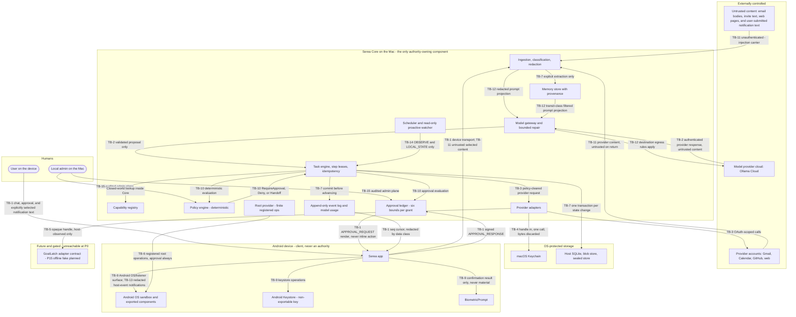

# Serea Threat Model: Assets and Trust Boundaries

Part of `serea-tm/0.1.0` · Threat model version `serea-tm/0.1.0` · Written against `serea-arch/0.1.0` (protocols frozen 2026-10-01)

Index: [Threat model index](README.md)

This document names what Serea must protect and where protection stops. It is
deliberately dull. Everything interesting is in
[03 — Abuse cases and mitigations](03-abuse-cases-and-mitigations.md).

---

## 0. Core principle

> An asset is something whose loss, disclosure, or forgery would change what
> Serea is for. A trust boundary is a line where the answer to "who is this and
> what may they decide" changes.

Both lists are written from the host's point of view. Serea Core on the Mac is
the only component that owns authority; everything else is either a client, a
data source, a data sink, or a delegate.

---

## 1. Assets

`DataClass` values are the frozen five from
[Data Classification Protocol §2](../protocols/09-data-classification-protocol.md#2-the-dataclass-set).
Confidentiality and Integrity are stated as the requirement, not the current
state; where the current state is weaker, the gap is recorded in
[03 — Abuse cases §5](03-abuse-cases-and-mitigations.md#5-summary-of-gaps).

| ID | Asset | Description | Why valuable | Confidentiality need | Integrity need | Where it lives | DataClass |
| --- | --- | --- | --- | --- | --- | --- | --- |
| AST-1 | Email and calendar content | Message bodies, subjects, senders, attachments; event titles, locations, attendee lists, descriptions | Third-party personal information about the user and about people who wrote to them. Disclosure is a harm to them, not only to the user. | High — must never reach a cloud model above the configured floor, and never a log | High — a substituted body changes what Serea proposes | Provider cache (encrypted at rest); provider adapters | `PRIVATE` bodies, `PERSONAL` metadata |
| AST-2 | Android device notification-listener text | Titles and bodies from other apps that the Serea Android app may observe through notification-listener access. This is distinct from notification content Serea posts and from text the user submits to Serea. | Carries other apps' private content into the device-local Serea surface; a listener observation is not a Core-ingestion path | High — `PRIVATE`, device-local by default; never sent to Core merely because the listener observed it | High | Android notification listener/device cache | `PRIVATE` |
| AST-3 | OAuth refresh tokens | Gmail and Calendar OAuth refresh tokens | Full account impersonation, including reading and sending mail and modifying the calendar | Absolute — the only permitted destination is the OS credential store | Absolute — a substituted token is account takeover | macOS Keychain only | `CREDENTIAL` |
| AST-4 | Device private key | Ed25519 key generated in Android Keystore with export disabled | Authenticates the phone to the host. Possession is the root of every device-side claim. | Absolute — never leaves the device, never reaches the host | Absolute — a substituted key is a new identity | Android Keystore / hardware-backed gate | `CREDENTIAL` |
| AST-5 | Host signing key and pinned fingerprint | The host's signing key used for pairing attestation, and the `host_key_fingerprint` every device pins | A forged host attestation enrols rogue devices; a silently rotated key breaks every client at once | High — the private half never leaves the host | Absolute — rotation must be loud or every device bricks | Host keychain; fingerprint mirrored into device storage | `CREDENTIAL` for the key; `PUBLIC` for the fingerprint |
| AST-6 | Pairing nonces and handshake challenges | One-time 256-bit secrets for pairing and mutual authentication | A reusable pairing nonce is a device-enrolment replay; a leaked host challenge is a session hijack primitive | Absolute — host memory only, destroyed on use, never logged | Absolute — single-use enforcement is the control | Host memory, per handshake | `CREDENTIAL` |
| AST-7 | Model provider API credentials | The bearer credential for the Ollama Cloud account | Cost control and quota control; identifies the user's usage | Absolute — OS credential store only | Absolute | macOS Keychain | `CREDENTIAL` |
| AST-8 | Device pairing roster | The set of paired `DeviceId`s, key fingerprints, sessions, revocation state, and which devices may approve | Decides who counts as "the user" for approval purposes. Editing it inserts an attacker-controlled approver. | High — contains fingerprints and device names | Absolute — an added entry is an added authority | Host durable storage | `SECRET` |
| AST-9 | Policy ruleset | Durable, versioned rule records plus the per-capability `disabled` overlay | Defines what is even eligible to happen. Weakening one rule converts many denied calls into approved ones. | High | Absolute — must be auditable and must not be silently edited | Host durable storage, admin plane only | `SECRET` |
| AST-10 | Approval ledger | `ApprovalRequest`, `ApprovalGrant`, consumption records, `grant_digest`, and the audit events | The only record of *whose authority* an effect was exercised under. A forged grant is direct authority escalation. | High | Absolute — and currently **unsealed**; see AST-16 | Host durable storage | `SECRET` |
| AST-11 | Capability registry | Enabled `CapabilityDescriptor`s, their pinned versions, and the `disabled` overlay | Registering a capability creates the possibility of calling it. A capability that is not in the registry does not exist, so registry integrity *is* the capability surface. | Medium | Absolute — registry writes are an audited admin-plane operation | Host durable storage | `PUBLIC` descriptors, `SECRET` for the overlay |
| AST-12 | Durable task store | `AssistantTask`, `TaskStep`, `arguments_digest`, `idempotency_key`, leases, receipts, failure reasons | Records what Serea was asked to do and what it did. Corruption here produces duplicated effects, stranded tasks, or false completion. | High — contains argument blobs | Absolute — step success and receipt must commit before the task advances | Host SQLite plus a content-addressed argument blob store | `PERSONAL` minimum, `PRIVATE` where arguments are |
| AST-13 | Memory store | Extracted long-term items with `stored_class`, `transit_class`, provenance, and tombstones | Durable attacker-authored "facts" that silently steer future behaviour without any user ever asking again | High — inherits its source class | High — provenance is immutable and required | Host durable storage | Inherited: a `PRIVATE` email yields a `PRIVATE` item |
| AST-14 | Model prompts and completions | Assembled prompt fragments, redacted projections, model responses, repair exchanges | The one component fully under adversarial influence. Also the place a credential would land if any control failed. | High — the prompt carries the user's personal context | Medium — a forged completion is caught later, at validation | Host memory and `model_usage` records | Up to `PERSONAL` (or `PRIVATE` under the host setting); never `SECRET` or `CREDENTIAL` |
| AST-15 | Serea-posted notification bodies, chat deltas, and timeline items | Host-event-derived, redacted projections rendered to the user on the device. Serea-posted notification content is distinct from Android notification-listener text and user-submitted text. | Covert egress surface: anything rendered here is readable by anyone who can see the screen or read notifications | High — apply the data-egress rules and redaction before rendering or posting; do not include excluded classes | Medium | Device-local; derived from the event stream | `PERSONAL`, `PRIVATE` only as permitted after redaction |
| AST-16 | Host durable storage as a whole | The SQLite database, the argument blob store, the event log, and the sealed store | Tampering here is the single most powerful attack in the model: it rewrites what is permitted, what was approved, and what was done. | High | Absolute — and the frozen protocol set specifies **no integrity seal** over it; see [03 §5](03-abuse-cases-and-mitigations.md#5-summary-of-gaps) | macOS filesystem | Mixed, per table above |
| AST-17 | Audit trail | The append-only event log and the `model_usage` table | The only way to answer "what did Serea do, on whose authority, at what cost" after the fact. Its loss converts every other control into an unverifiable claim. | High — digests and shapes, never `PRIVATE` payload bytes | High — append-only, gapless `seq`, one transaction with the state change | Host durable storage, event stream | `PUBLIC` metadata with digests |
| AST-18 | Delegated host-goal results | `GoalHandle`, `GoalObservedState`, `GoalSummary`, artifacts, `GOAL_RESULT` evidence | Serea will tell the user that code on their machine was changed. A false report there is a false statement about the user's own filesystem. | High — summaries are redacted before egress | High — evidence must be host-observed, never model-reported | Host content-addressed store, referenced by receipt | `PERSONAL` |
| AST-19 | Root capability surface | The finite, host-registered set of operations the root provider will perform | Root is the only route by which Serea could exceed its own sandbox. The danger is in the *set*, not in whether root is present. | High | Absolute — every entry is individually registered and individually approved | Root provider registration table | `SECRET` |
| AST-20 | Device-side cache | Cached provider data, cached timeline pages, buffered chat messages | Holds `PRIVATE` content outside the host's redaction boundary, and queued messages that were never submitted | High — device-local only | Medium — a poisoned cache misinforms the user | Device app storage | `PRIVATE` |
| AST-21 | Bounds and durable configuration | The bound set, `cloud_model_private_egress`, `codex_allowed`, retention settings | Controls blast radius and egress. Raising `max_daily_spend_usd` or enabling private egress is a consequential, auditable act. | Medium | Absolute — raising is an audited admin action; per-task ceilings may only tighten | Host durable state | `SECRET` |
| AST-22 | Credential handles | The opaque `sha256:` references by which the host names a secret without holding it | A handle is not a secret, but a leaked handle plus a confused provider boundary could still enable a confused-deputy read | Medium — deliberately reveals no address, service, or account | High — a stale handle must fail loudly rather than read the old value | Host memory and durable state | `CREDENTIAL`-derived, non-secret-bearing |

### 1.1 Notes on three rows that are easy to under-rate

- **AST-9 and AST-10 are the crown jewels.** Everything else in this table can
  be re-derived or re-fetched. A weakened policy rule or a forged grant cannot;
  they change what the user believes Serea is.
- **AST-16 is rated for integrity but has no mechanism.** The protocol set
  assumes the host filesystem is trustworthy and spends its controls on
  semantics inside the host. That assumption is stated nowhere, which makes it
  an implicit trust decision rather than a documented one.
- **AST-1's holder is not only Serea.** Third parties wrote those bodies. The
  asset's confidentiality need is owed to *them*, which is why the egress matrix
  and redaction exist as host code rather than as prompt instructions
  ([Data Classification Protocol §1](../protocols/09-data-classification-protocol.md#1-why-classification-exists)).

---

## 2. Trust boundaries

`Authenticated` means the crossing carries a verifiable proof of *identity*.
`Authorized` means the crossing was checked against policy, scope, and grants.
The two are independent, and Serea is explicit about the cases where a crossing
is authenticated but carries no authority at all.

| ID | Boundary | What crosses | Direction | Authenticated | Authorized |
| --- | --- | --- | --- | --- | --- |
| TB-1 | Device → Core | Device protocol envelopes, including user-submitted text, approval responses, device events, and host responses | Both directions; device always dials out | Yes — mutual Ed25519, pinned host fingerprint, per-frame signature, `message_id` dedupe | Partially. A session authenticates the device and **never** the user's intent; authority arrives separately per action ([D6](../protocols/07-device-protocol.md#10-invariants-summary)) |
| TB-2 | Model → Core | `ModelResponse.content` and `.structured` | Cloud model → host | Authenticated as a provider response, not as trustworthy content | **No authority** is granted to model output, which remains data to validate ([Model Protocol §4.1](../protocols/03-model-protocol.md#41-the-trust-boundary-stated-precisely)) |
| TB-3 | Core → external service | Validated capability requests and OAuth-scoped calls; returned provider data and results | Host ↔ Gmail, Calendar, GitHub, web, and other external providers | Yes — provider credentials held via `CredentialHandle` | Yes — policy and approval govern calls; returned content is untrusted and separately classified at `TB-11` |
| TB-4 | Host → credential store | `CredentialHandle` in, secret bytes out for exactly one call, then discarded | Host ↔ OS credential store | Yes — inside the store's process boundary, on the host's own authority | Yes, and structurally narrow: a provider can never reach another provider's credential ([C8](../protocols/01-capability-protocol.md#11-invariants-summary)) |
| TB-5 | Host → GoalLatch adapter | `GoalHandle`, `GoalObservedState`, `GoalSummary`, artifact handles, `GOAL_RESULT` evidence | Host ↔ adapter ↔ GoalLatch | **Not established at P0.** This is a contract-only boundary; no provider is implemented. The offline `FakeGoalLatchProvider` is planned for P15 and will touch no network, file, or subprocess ([G1](../protocols/08-goallatch-adapter-protocol.md#11-invariants-summary)) | **No, permanently.** No GoalLatch-derived statement about who may act or what was approved is authoritative |
| TB-6 | Host → local OS resources | Filesystem, subprocess, network endpoints, root capability operations | Host ↔ local OS/root surface | Process-local / OS-mediated; no remote identity is implied | Constrained to enumerated capabilities; root operations are registered and always require approval ([P7](../protocols/04-policy-protocol.md#9-invariants-summary)) |
| TB-7 | Core → durable store | Task, step, receipt, grant, event, memory, and usage rows; argument blobs | Host ↔ SQLite and blob store | Yes — the host's own filesystem authority | Yes — single-writer transactions, and event plus state change commit together ([E3](../protocols/06-event-protocol.md#9-invariants-summary)) |
| TB-8 | Provider → Provider | No data crosses directly; the boundary is the absence of provider-to-provider authority, mutable state, or callbacks | None | None | Providers receive no ambient authority and cannot access another provider's credentials or state |
| TB-9 | Android app → Android OS | Keystore and biometric operations, notification-listener observations, Serea notification posting, exported-component/intent interactions | App ↔ Android OS | Platform sandboxing and hardware-backed key gate | The platform governs keystore and biometrics; Serea must constrain its exported surface ([AB-14](03-abuse-cases-and-mitigations.md#ab-14-malicious-device-app-abusing-an-exported-device-component)). Listener observations stay local unless the user explicitly selects and submits text to Serea; Serea-posted text follows outbound data-egress/redaction rules |
| TB-10 | Host → Policy engine | Capability descriptor, task `policy_class`, automation context, approval ledger, declared data class, device registry state | Host → policy engine, in-process | Not applicable — same process | Yes, deterministically: [P1](../protocols/04-policy-protocol.md#9-invariants-summary) makes the decision a pure function of durable state |
| TB-11 | Retrieved content → Host ingestion | Email bodies, calendar descriptions, web-page text, and only Android notification text explicitly selected and submitted by the user | External world or user-mediated device submission → host | **No.** Content is classified by origin, not by inspection; user submission identifies the submitting action, not the original notification author | `PRIVATE` on arrival; Android listener observation alone does not cross this boundary. Promotion to memory requires explicit `EXTRACTION` ([DC11](../protocols/09-data-classification-protocol.md#9-invariants-summary)) |
| TB-12 | Host → cloud model prompt egress | Redacted prompt content and associated model request data | Host → cloud model | Provider API credential authenticates the host | Only data permitted by the egress matrix may cross; `SECRET` and `CREDENTIAL` are denied ([Data Classification §5](../protocols/09-data-classification-protocol.md#5-egress-rules)) |
| TB-13 | Host → Device notifications | Host-event-derived notification text, channel, and importance | Host → app → OS notification manager | Same authenticated device session | Apply data-egress classification and redaction before rendering/posting; **no notification action may cause or authorize an effect** ([D10](../protocols/07-device-protocol.md#10-invariants-summary)). Other apps with notification-listener access are outside Serea's control |
| TB-14 | Scheduler/watcher → Task engine | Durable schedule wake-ups, watcher candidates, bounded proposal output | Scheduler → host, in-process | Not applicable | Restricted: automation context permits only `OBSERVE` and `LOCAL_STATE` ([P5](../protocols/04-policy-protocol.md#9-invariants-summary)) |
| TB-15 | Local admin → Host controls | Rule edits, `disabled` overlay changes, grant creation, bound changes | Local user → host configuration | Yes — local session with admin rights | Audited with before/after diff; unreachable from model output and device ordinary settings ([P9](../protocols/04-policy-protocol.md#9-invariants-summary)) |

### 2.1 Boundaries that most implementations get wrong

Four of these have a habit of being collapsed during implementation, so they are
called out here rather than left to the protocol documents alone:

1. **TB-2 is authenticated but unauthorized.** A provider response may be
   authenticated as a model-provider response; that proves nothing about
   whether the content is safe to act on. This is the boundary most likely to be
   short-circuited by "the model usually gets it right."
2. **TB-1 is not a consent channel.** A live device session renders prompts; it
   does not approve them. Collapsing these is what turns a paired phone into a
   standing credential.
3. **TB-11 has no authentication story at all.** An email body is not a
   statement by anyone Serea has authenticated. Treating it as one is the
   single most common architecture failure in systems that read user mail.
4. **TB-5 is unauthenticated *by design*.** GoalLatch is a delegate that Serea
   intends to distrust: it reports facts about goals and never facts about
   authority. The day an adapter is trusted for authority is the day this
   boundary has been crossed.

---

## 3. Trust boundary diagram

Read it top-to-bottom: everything above the first horizontal line is
externally controlled; the large middle band is the only authority-owning
region; the device and the OS stores are clients and protectants; the bottom
band does not exist yet.

### 3.1 Diagram conventions

- Every `TB-n` label corresponds to the architecture registry entry in §2. Edges
  inside Core that do not cross a registered boundary are shown without a TB ID;
  `TB-8` is intentionally shown as an absence of provider-to-provider flow.
- `TB-2` and `TB-11` carry hostile content: authenticated model responses remain
  untrusted, and retrieved content has no authenticated author at ingestion.
- `TB-5` is drawn because the contract boundary is defined now; no provider
  implements it in P0. The planned P15 fake will exercise the edge. Drawing the
  future edge stops a real adapter from being designed without a boundary.
- `TB-12` labels prompt egress specifically; `TB-13` labels the separate
  host-event notification egress to the device surface.

---

## 4. What this document does not claim

- It does not claim the host filesystem is trustworthy. It assumes it, because
  the protocols do, and records the assumption as a finding
  ([AB-15](03-abuse-cases-and-mitigations.md#ab-15-tampering-with-the-policy-ruleset),
  [AB-16](03-abuse-cases-and-mitigations.md#ab-16-forging-or-replaying-an-approval-grant)).
- It does not claim TLS, Ed25519, SHA-256, JSON Schema 2020-12, ULIDs, or the
  Android Keystore are unimpeachable. Those are out of scope; see
  [02 — Adversaries §4](02-adversaries-and-attack-surface.md#4-explicitly-out-of-scope-for-p0).
- It does not claim the device is trustworthy. A compromised device can lie
  about itself freely; the boundary table reflects only what it cannot
  manufacture, which is authority it was never granted.

Index: [Threat model index](README.md) · Next:
[02 — Adversaries and attack surface](02-adversaries-and-attack-surface.md)